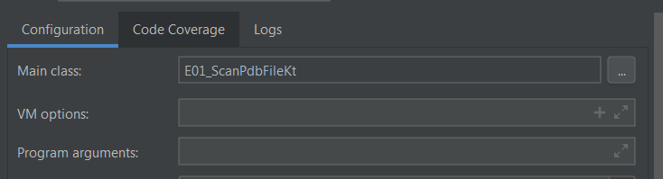

# KotmolPdbParserExamplesJVM

This repo contains Intellij IDEA based 
projects that use the KotmolPdbParser 
library.

- _E01-ScanPdbFile_  
    Simply parses a PDB file located in the `files/` folder.

- _E02-ScanMotmPdbFiles_  
    Simply parses a PDB file located in the `files/` folder.
The curent list was extracted from the PDB moleules featured
in during 20 years of the [Molecule of the Month][1].   
Currently the list has 981 entries.
If you want to scan all 981 entries, then you must first 
download them into an external folder.   A script is 
provided to do this in the `docs/downloadPdbFiles` folder.
The script calls the [wget][2] program to do the downloading
from the [rcsb.org][3] web page.

### Running in the Android Studio IDE

The project build is based on Gradle, and 
so should in theory build without issues
in Android Studio.   To run
in Android Studio, do an `Edit Configurations`,
then create a Kotlin config from the template drop-down
list, and then enter the kotlin filename
as the class as shown in the screen shot below.

[1]:https://pdb101.rcsb.org/
[2]:https://www.gnu.org/software/wget/
[3]:https://rcsb.org

